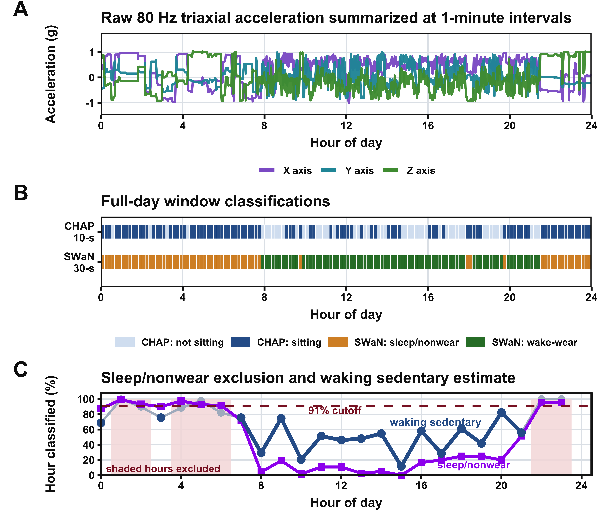

# Sedentary-Time-Estimation in United States- NHANES 2011-2014

Repository for a manuscript on estimating waking sedentary time from wearable accelerometer data. The analysis combines wrist-worn CHAP posture predictions, SWaN sleep/non-wear classification, and survey-weighted NHANES models to evaluate sedentary time across participant characteristics and to calibrate a 91% sleep/non-wear cutoff.

## Repository Scope

This repository provides the manuscript source, analysis notebooks, reusable R scripts, data inputs, and exported outputs needed to reproduce the paper's figures and tables. It is intended as a companion repository for readers, reviewers, and future users who want to inspect or rerun the workflow.

## Main Files

- `manuscript_main.Rmd` - primary manuscript source used to generate the report.
- `analysis.Rmd` - supporting analysis notebook for intermediate calculations and outputs.
- `R/` - reusable R scripts for figures and other project helpers.
- `data/` - analysis input data retained for reproducibility.
- `figures/` - exported figure files used in the manuscript.
- `outputs/` - exported tables and text outputs used in the manuscript.
- `renv/`, `renv.lock` - project package environment.
- `pctSitting_research.Rproj` - RStudio project file.

## Data Included In The Repo

The repository retains the data files required by the manuscript workflow so readers can reproduce the summary tables, figures, and cutoff calibration used in the paper. Each dataset serves a different part of the analysis:

- `data/analysis_ready_1h_epoch/nosleep_data.csv.gz` contains the hip-worn sedentary-time summaries used for the comparison analyses and for manuscript tables that contrast hip and wrist estimates.
- `data/analysis_ready_1h_epoch/wrist_df.csv.gz` contains the wrist-worn 1-hour sitting summaries used as the main exposure source for the waking sedentary analyses.
- `data/analysis_ready_1h_epoch/sleep_est_data.csv.gz` contains the 1-hour sleep and non-wear summaries used to identify records excluded by the calibrated sleep/non-wear rule.
- `data/self-sleep-2011-12.xpt` contains the self-reported sleep data for the 2011-2012 NHANES cycle, used for calibration and validation of the sleep threshold.
- `data/self-sleep-2013-14.xpt` contains the self-reported sleep data for the 2013-2014 NHANES cycle, used alongside the 2011-2012 cycle to support pooled analyses.
- `data/top_level_data_1h_epoch/` contains the upstream raw ActiGraph, CHAP, and SWaN example files used to build the preprocessing workflow figure for the current 1-hour summary analysis. Epoch-specific upstream folders can be added alongside it for future sensitivity analyses, such as 30-second or 1-minute summaries.

## Reproducing The Manuscript

From the project root:

```bash
Rscript -e "renv::restore()"
Rscript -e "rmarkdown::render('manuscript_main.Rmd')"
```

To run the supporting analysis notebook instead:

```bash
Rscript -e "rmarkdown::render('analysis.Rmd')"
```

## Outputs

- Figures are written to `figures/` and tables/text outputs are written to `outputs/`.
- The repository uses `renv` to keep package versions consistent across machines.

## Manuscript Tables And Figures

- **Table 1** summarizes the analytic sample and wear-day distribution by NHANES cycle, showing how many participants contributed valid wear days across 2011-2012 and 2013-2014.
- **Table 2** compares sedentary-time estimates across studies, measurement methods, datasets, and populations so readers can place the manuscript results in context.
- **Table 3** reports survey-weighted mean sedentary time by age and gender, highlighting how waking sedentary time varies across demographic groups.
- **Table 4** reports survey-weighted mean sedentary time by race/ethnicity and BMI category, showing how the estimates differ across body composition and population strata.
- **Figure 1** shows the preprocessing workflow from raw 80 Hz accelerometer data to CHAP and SWaN summaries and the hourly sleep/non-wear cutoff logic used to define waking sedentary time.
- **Figure 2** presents survey-weighted hourly sedentary patterns by day type before and after sleep exclusion, comparing CHAP-predicted sitting with waking sedentary estimates.
- **Figure 3** shows how participants are distributed across mean daily waking sedentary-time categories and how those categories map to the 24-hour behavioral composition of sedentary time, sleep/non-wear, and other waking time.
- **Figure 4** shows sleep-cutoff calibration and sedentary-time sensitivity across candidate thresholds, with the 91% cutoff marked as the selected rule.

## Featured Figure



This figure summarizes the preprocessing workflow used in the manuscript, including the raw accelerometer signal, CHAP and SWaN classification summaries, and the 91% sleep/non-wear cutoff used to define waking sedentary time.

## Related Repository

Readers interested in how the analysis inputs were generated and summarized can find the top-level Python preprocessing workflow here: [SedentaryBproject](https://github.com/codoom1/SedentaryBproject). That repository contains the CHAP and SWaN processing steps used to create the summary data consumed by this manuscript project.

## Citation

Citation details for the manuscript will be added here when the paper is published.

## License

This repository is released under the Apache License 2.0. See [LICENSE](LICENSE) for the full text.
