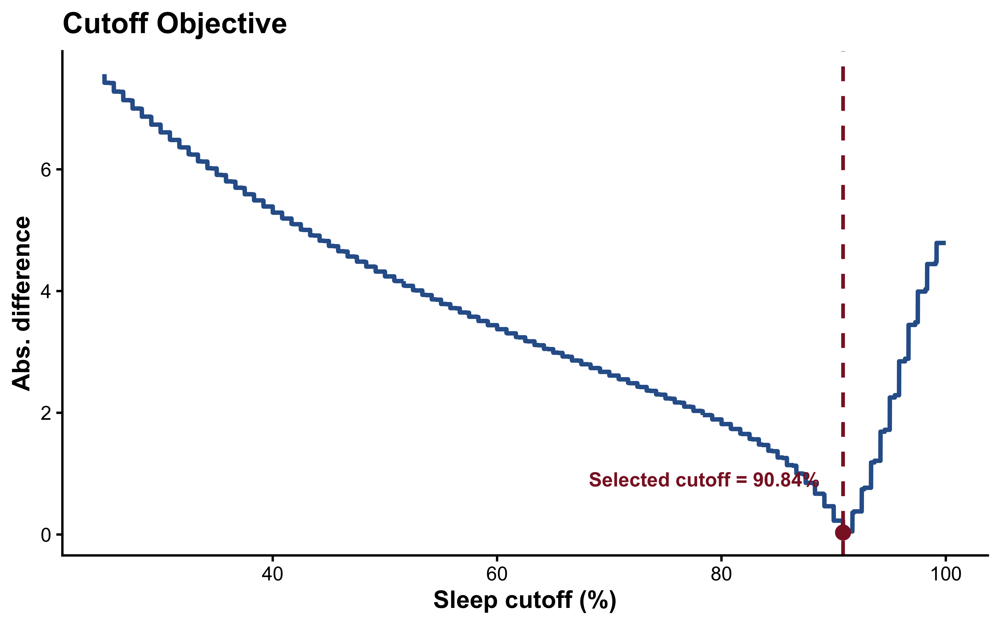

```{r setup, include=FALSE}
knitr::opts_chunk$set(
  echo = TRUE,
  warning = FALSE,
  message = FALSE,
  fig.align = "center"
)

dir.create("figures", showWarnings = FALSE)
dir.create("outputs", showWarnings = FALSE)
```

## Purpose

This R Markdown file reproduces the main manuscript outputs from the source data: analytic tables, workflow and result figures, cutoff calibration, and exported figure/table files.

## Packages

```{r packages}
library(dplyr)
library(ggplot2)
library(haven)
library(knitr)
library(patchwork)
library(purrr)
library(readr)
library(scales)
library(survey)
library(tidyr)
```

```{r survey-options}
options(survey.lonely.psu = "adjust")
```

## Load And Prepare Data

```{r load-data}
sedentary_hip_df <- read_csv("data/analysis_ready_1h_epoch/nosleep_data.csv.gz", show_col_types = FALSE) ## old hip-based sedentary estimates for comparison

sedentary_wrist_df <- read_csv("data/analysis_ready_1h_epoch/wrist_df.csv.gz", show_col_types = FALSE) ## CHAP wrist-based sitting estimates(The manuscript uses this as the primary sedentary behavior measure)
sleep_df <- read_csv("data/analysis_ready_1h_epoch/sleep_est_data.csv.gz", show_col_types = FALSE) ## SWaN sleep/nonwear estimates used for sleep-cutoff calibration and sleep-aware sedentary time estimation
```

```{r prepare-hourly-data}
sedentary_hip_df <- sedentary_hip_df %>%
  rename(
    Day = Date,
    percent_sedentary_hip = PercentSedentary
  ) %>%
  filter(PartialDay != "Yes") %>%
  mutate(
    Exam_weight_recal = 0.5 * Exam_weight,
    Dataset = if_else(Dataset == "2011-12", "2011-2012", "2013-2014")
  )

sedentary_wrist_df <- sedentary_wrist_df %>%
  rename(percent_sedentary_wrist = percent_sitting) %>%
  select(ID, Day, Hour, percent_sedentary_wrist)

sleep_df <- sleep_df %>%
  transmute(
    ID,
    Day,
    Hour,
    percent_sleep = percent_sleep_nonwear
  )

sedentary_df <- inner_join(
  x = sedentary_wrist_df,
  y = sedentary_hip_df,
  by = c("ID", "Day", "Hour")
)

sleep_sed_df <- inner_join(
  x = sedentary_df,
  y = sleep_df,
  by = c("ID", "Day", "Hour")
)

demo_unique <- sedentary_df %>%
  mutate(
    Age_group = case_when(
      Age < 18 ~ "<18",
      Age <= 34 ~ "18-34",
      Age <= 44 ~ "35-44",
      Age <= 64 ~ "45-64",
      TRUE ~ ">=65"
    ),
    BMI = Weight / (Height / 100)^2,
    BMI_cat = case_when(
      BMI < 25 ~ "under/normal weight",
      BMI < 30 ~ "over weight",
      TRUE ~ "obesity"
    )
  ) %>%
  group_by(ID) %>%
  summarise(
    Age_group = first(Age_group),
    BMI_cat = first(BMI_cat),
    Race = first(Race),
    Gender = first(Gender),
    Education = first(Education_coarse),
    Marital_status = first(Marital_status),
    Exam_weight_recal = first(Exam_weight_recal),
    PSU = first(PSU),
    Stratum = first(Stratum),
    Dataset = first(Dataset),
    .groups = "drop"
  )
```

## Reusable Functions

```{r functions}
add_epoch_duration <- function(df, default_epoch_duration_hours = 1) {
  if (!"epoch_duration_hours" %in% names(df)) {
    df <- df %>%
      mutate(epoch_duration_hours = default_epoch_duration_hours)
  } else {
    df <- df %>%
      mutate(epoch_duration_hours = replace_na(epoch_duration_hours, default_epoch_duration_hours))
  }

  df
}

compute_sedentary_by_cutoff <- function(df, cutoffs, default_epoch_duration_hours = 1) {
  df <- add_epoch_duration(df, default_epoch_duration_hours)
  id_days <- distinct(df, ID, Day)

  map_dfr(cutoffs, function(cut) {
    df %>%
      filter(percent_sleep < cut) %>%
      group_by(ID, Day) %>%
      summarise(
        total_sed_hours = sum((percent_sedentary_wrist / 100) * epoch_duration_hours, na.rm = TRUE),
        wake_hours = sum(epoch_duration_hours, na.rm = TRUE),
        n_epochs = n(),
        .groups = "drop"
      ) %>%
      right_join(id_days, by = c("ID", "Day")) %>%
      mutate(
        total_sed_hours = replace_na(total_sed_hours, 0),
        wake_hours = replace_na(wake_hours, 0),
        n_epochs = replace_na(n_epochs, 0),
        sleep_hrs = 24 - wake_hours,
        cutoff = cut
      )
  })
}

get_svy_estimates <- function(data_cut) {
  des <- svydesign(
    id = ~PSU,
    strata = ~Stratum,
    weights = ~Exam_weight_recal,
    nest = TRUE,
    data = data_cut
  )

  sleep_est <- svymean(~mean_sleep_hours, des, na.rm = TRUE)
  sed_est <- svymean(~mean_sed_hours, des, na.rm = TRUE)

  tibble(
    cutoff = unique(data_cut$cutoff),
    sleep_mean = coef(sleep_est)[1],
    sleep_se = SE(sleep_est)[1],
    sed_mean = coef(sed_est)[1],
    sed_se = SE(sed_est)[1]
  )
}

get_svy_estimates_by_cutoff <- function(data) {
  des <- svydesign(
    id = ~PSU,
    strata = ~Stratum,
    weights = ~Exam_weight_recal,
    nest = TRUE,
    data = data
  )

  svyby(
    ~mean_sleep_hours + mean_sed_hours,
    ~cutoff,
    des,
    svymean,
    na.rm = TRUE,
    vartype = "se"
  ) %>%
    as_tibble() %>%
    transmute(
      cutoff,
      sleep_mean = mean_sleep_hours,
      sleep_se = se.mean_sleep_hours,
      sed_mean = mean_sed_hours,
      sed_se = se.mean_sed_hours
    )
}

format_mean_ci <- function(design_obj, variable = "mean_sed_hours", digits = 2) {
  m <- svymean(as.formula(paste0("~", variable)), design_obj, na.rm = TRUE)
  ci <- confint(m)
  sprintf(
    paste0("%.", digits, "f (%.", digits, "f, %.", digits, "f)"),
    coef(m)[1],
    ci[1, 1],
    ci[1, 2]
  )
}

format_n_pct <- function(df, denominator) {
  n <- n_distinct(df$ID)
  sprintf("%s (%.1f%%)", comma(n), 100 * n / denominator)
}
```

## Table 1

Table 1. Analytic sample and wear-day distribution by NHANES cycle (2011-2014)

```{r table-1}
df_days <- sleep_sed_df %>%
  distinct(ID, Day, Dataset) %>%
  group_by(ID, Dataset) %>%
  summarise(n_days = n(), .groups = "drop")

table_by_cycle <- df_days %>%
  count(Dataset, n_days, name = "n") %>%
  group_by(Dataset) %>%
  mutate(
    percent = 100 * n / sum(n),
    value = paste0(comma(n), " (", round(percent, 1), ")")
  ) %>%
  ungroup() %>%
  select(n_days, Dataset, value) %>%
  pivot_wider(names_from = Dataset, values_from = value)

table_total <- df_days %>%
  count(n_days, name = "n") %>%
  mutate(
    percent = 100 * n / sum(n),
    `Total (2011-14)` = paste0(comma(n), " (", round(percent, 1), ")")
  ) %>%
  select(n_days, `Total (2011-14)`)

table1 <- table_by_cycle %>%
  left_join(table_total, by = "n_days") %>%
  arrange(n_days) %>%
  mutate(n_days = as.character(n_days))

sample_row <- df_days %>%
  group_by(Dataset) %>%
  summarise(n = n(), .groups = "drop") %>%
  mutate(value = paste0(comma(n), " (100.0)")) %>%
  select(Dataset, value) %>%
  pivot_wider(names_from = Dataset, values_from = value) %>%
  mutate(
    n_days = "Sample Analyzed (1-7)",
    `Total (2011-14)` = paste0(comma(nrow(df_days)), " (100.0)")
  )

table1 <- bind_rows(table1, sample_row) %>%
  select(
    `Full days` = n_days,
    `2011-2012`,
    `2013-2014`,
    `Total (2011-14)`
  )

write_csv(table1, "outputs/table1_wear_day_distribution.csv")

kable(
  table1,
  caption = "Table 1. Analytic sample and wear-day distribution by NHANES cycle (2011-2014)."
)
```

Notes: A full day is a 24-hour day with 24 hourly records; partial initiation/return days are excluded.

## Cutoff Calibration Data

```{r cutoff-calibration}
cutoffs <- seq(25, 100, 1)
sed_all <- compute_sedentary_by_cutoff(sleep_sed_df, cutoffs)

df_person <- sed_all %>%
  group_by(ID, cutoff) %>%
  summarise(
    mean_sed_hours = mean(total_sed_hours, na.rm = TRUE),
    mean_sleep_hours = mean(sleep_hrs, na.rm = TRUE),
    .groups = "drop"
  )

model_df <- df_person %>%
  left_join(demo_unique, by = "ID") %>%
  filter(
    !is.na(Exam_weight_recal),
    !is.na(PSU),
    !is.na(Stratum)
  )

results <- get_svy_estimates_by_cutoff(model_df)
```

```{r self-reported-sleep}
sleep_2011_12 <- read_xpt("data/self-sleep-2011-12.xpt")
sleep_2013_14 <- read_xpt("data/self-sleep-2013-14.xpt")

self_sleep <- bind_rows(sleep_2011_12, sleep_2013_14) %>%
  transmute(
    ID = SEQN,
    self_reported_slp_hrs = SLD010H
  ) %>%
  filter(
    !is.na(self_reported_slp_hrs),
    !(self_reported_slp_hrs %in% c(77, 99))
  )

self_sleep_weighted <- self_sleep %>%
  left_join(
    demo_unique %>% select(ID, Exam_weight_recal, PSU, Stratum),
    by = "ID"
  ) %>%
  filter(!is.na(Exam_weight_recal))

des_self_sleep <- svydesign(
  id = ~PSU,
  strata = ~Stratum,
  weights = ~Exam_weight_recal,
  nest = TRUE,
  data = self_sleep_weighted
)

mean_self_sleep <- svymean(~self_reported_slp_hrs, design = des_self_sleep, na.rm = TRUE)
self_sleep_mean <- as.numeric(coef(mean_self_sleep)[1])
self_sleep_ci <- as.numeric(confint(mean_self_sleep)[1, ])

best_cutoff <- results %>%
  mutate(diff = abs(sleep_mean - self_sleep_mean)) %>%
  slice_min(diff, n = 1, with_ties = FALSE)

selected_cutoff <- as.numeric(best_cutoff$cutoff[1])
selected_cutoff
```


## Optimal Sleep Cutoff Selection

```{r optimal-cutoff}
compute_person_for_cutoff <- function(cutoff_value, df = sleep_sed_df, default_epoch_duration_hours = 1) {
  compute_sedentary_by_cutoff(
    df = df,
    cutoffs = cutoff_value,
    default_epoch_duration_hours = default_epoch_duration_hours
  ) %>%
    group_by(ID, cutoff) %>%
    summarise(
      mean_sed_hours = mean(total_sed_hours, na.rm = TRUE),
      mean_sleep_hours = mean(sleep_hrs, na.rm = TRUE),
      .groups = "drop"
    ) %>%
    left_join(demo_unique, by = "ID") %>%
    filter(
      !is.na(Exam_weight_recal),
      !is.na(PSU),
      !is.na(Stratum)
    )
}

get_sleep_mean_for_cutoff <- function(cutoff_value) {
  below_cutoff <- findInterval(cutoff_value, sleep_values, left.open = TRUE)
  wake_weighted_hours <- if (below_cutoff == 0) 0 else cumulative_epoch_weight[below_cutoff]
  sleep_weighted_hours <- total_epoch_weight - wake_weighted_hours

  sleep_weighted_hours / total_person_weight
}

get_sleep_diff_for_cutoff <- function(cutoff_value) {
  abs(get_sleep_mean_for_cutoff(cutoff_value) - self_sleep_mean)
}

sleep_sed_epoch_df <- add_epoch_duration(sleep_sed_df)

person_days <- sleep_sed_epoch_df %>%
  distinct(ID, Day) %>%
  count(ID, name = "n_days")

valid_person_weights <- demo_unique %>%
  left_join(person_days, by = "ID") %>%
  filter(
    !is.na(Exam_weight_recal),
    !is.na(PSU),
    !is.na(Stratum),
    !is.na(n_days)
  ) %>%
  transmute(
    ID,
    person_weight = Exam_weight_recal,
    n_days
  )

epoch_weights <- sleep_sed_epoch_df %>%
  select(ID, percent_sleep, epoch_duration_hours) %>%
  inner_join(valid_person_weights, by = "ID") %>%
  transmute(
    percent_sleep,
    epoch_weight = (person_weight / n_days) * epoch_duration_hours
  ) %>%
  arrange(percent_sleep)

sleep_values <- epoch_weights$percent_sleep
cumulative_epoch_weight <- cumsum(epoch_weights$epoch_weight)
total_epoch_weight <- sum(epoch_weights$epoch_weight)
total_person_weight <- sum(valid_person_weights$person_weight)

objective_curve <- tibble(cutoff = seq(25, 100, by = 0.01)) %>%
  mutate(
    sleep_mean = map_dbl(cutoff, get_sleep_mean_for_cutoff),
    diff = abs(sleep_mean - self_sleep_mean)
  )

best_cutoff <- objective_curve %>%
  arrange(diff, cutoff) %>%
  slice(1)

selected_cutoff <- as.numeric(best_cutoff$cutoff[1])

model_df_best <- compute_person_for_cutoff(selected_cutoff)

selected_cutoff
best_cutoff
```


## Plotting the objective curve to visualize the cutoff selection process

```{r objective-curve-plot}
objective_plot <- ggplot(objective_curve, aes(x = cutoff, y = diff)) +
  geom_line(color = "#2F5F98", linewidth = 1.2) +
  geom_point(
    data = best_cutoff,
    aes(x = cutoff, y = diff),
    color = "#8B1E2D",
    size = 3.5
  ) +
  geom_vline(
    xintercept = selected_cutoff,
    color = "#8B1E2D",
    linewidth = 1,
    linetype = "dashed"
  ) +
  annotate(
    "text",
    x = selected_cutoff,
    y = max(objective_curve$diff, na.rm = TRUE) * 0.12,
    label = paste0("Selected cutoff = ", selected_cutoff, "%"),
    hjust = 1.1,
    color = "#8B1E2D",
    fontface = "bold",
    size = 4
  ) +
  labs(
    x = "Sleep cutoff (%)",
    y = "Abs. difference",
    title = "Cutoff Objective"
  ) +
  theme_classic(base_size = 14) +
  theme(
    plot.title = element_text(face = "bold"),
    axis.title = element_text(face = "bold"),
    axis.text = element_text(color = "black")
  )

ggsave(
  "figures/objective_function_cutoff.png",
  objective_plot,
  width = 8,
  height = 5,
  dpi = 600,
  bg = "white"
)
ggsave(
  "figures/objective_function_cutoff.pdf",
  objective_plot,
  width = 8,
  height = 5,
  bg = "white"
)

```

## Displaying the objective function plot to visualize the cutoff selection process


```{r objective-function-plot, fig.cap="Objective function for sleep-cutoff calibration. The curve shows the absolute difference between survey-weighted accelerometer-derived sleep duration and survey-weighted self-reported sleep duration across candidate sleep-percentage cutoffs. The dashed vertical line marks the selected cutoff.", out.width="60%", echo=FALSE}

```


## Main Analytic Dataset At Selected Cutoff

```{r selected-cutoff-data}
## model_df might not contain, so we recompute it for the selected cutoff to ensure consistency with the cutoff calibration process
if (selected_cutoff %in% model_df$cutoff) {
  model_df_best <- model_df %>%
    filter(cutoff == selected_cutoff)
} else {
  model_df_best <- compute_person_for_cutoff(selected_cutoff)
}

des_best <- svydesign(
  id = ~PSU,
  strata = ~Stratum,
  weights = ~Exam_weight_recal,
  nest = TRUE,
  data = model_df_best
)

model_df_91 <- model_df_best
des91 <- des_best

overall_sed <- svymean(~mean_sed_hours, des_best, na.rm = TRUE)
overall_sed_ci <- confint(overall_sed)
overall_sed
overall_sed_ci

sleep_aware_hourly_df <- sleep_sed_df %>%
  filter(percent_sleep < selected_cutoff)
```

## Justification for Combining Survey Cycles

```{r cycle-comparison}
## Justification for Combining Survey Cycles

cycle_design <- svydesign(
  id = ~PSU,
  strata = ~Stratum,
  weights = ~Exam_weight_recal,
  nest = TRUE,
  data = model_df_best %>%
    mutate(Dataset = factor(Dataset, levels = c("2011-2012", "2013-2014")))
)

cycle_sed_estimates <- svyby(
  ~mean_sed_hours,
  ~Dataset,
  cycle_design,
  svymean,
  na.rm = TRUE,
  vartype = "se"
) %>%
  as_tibble() %>%
  transmute(
    Dataset,
    mean_sed_hours,
    SE = se
  )

cycle_model <- svyglm(
  mean_sed_hours ~ Dataset,
  design = cycle_design
)

cycle_difference <- coef(cycle_model)["Dataset2013-2014"]
cycle_difference_se <- SE(cycle_model)["Dataset2013-2014"]
cycle_model_summary <- summary(cycle_model)

cycle_2011_12_mean <- cycle_sed_estimates$mean_sed_hours[cycle_sed_estimates$Dataset == "2011-2012"]
cycle_2011_12_se <- cycle_sed_estimates$SE[cycle_sed_estimates$Dataset == "2011-2012"]
cycle_2013_14_mean <- cycle_sed_estimates$mean_sed_hours[cycle_sed_estimates$Dataset == "2013-2014"]
cycle_2013_14_se <- cycle_sed_estimates$SE[cycle_sed_estimates$Dataset == "2013-2014"]

cycle_sed_estimates %>%
  mutate(
    `Mean sedentary time (hours/day)` = round(mean_sed_hours, 2),
    SE = round(SE, 2)
  ) %>%
  select(Dataset, `Mean sedentary time (hours/day)`, SE) %>%
  kable(
    caption = "Survey-weighted mean sedentary time by NHANES cycle."
  )

cycle_difference
cycle_difference_se

## Checking if the difference is statistically significant
cycle_p_value <- as.numeric(coef(cycle_model_summary)["Dataset2013-2014", "Pr(>|t|)"])
cycle_p_value

```


### Justification for Combining Survey Cycles

To assess whether the two NHANES cycles could be pooled, we compared survey-weighted estimates of mean sedentary time between 2011-2012 and 2013-2014. The mean sedentary time was `r round(cycle_2011_12_mean, 2)` hours/day (SE = `r round(cycle_2011_12_se, 2)`) in 2011-2012 and `r round(cycle_2013_14_mean, 2)` hours/day (SE = `r round(cycle_2013_14_se, 2)`) in 2013-2014. The survey-weighted regression estimate of the difference was `r round(cycle_difference, 2)` hours/day. This difference is small relative to the overall mean and provides no evidence of a meaningful change in sedentary time between cycles. Based on this, the two cycles were combined for all subsequent analyses. This approach is consistent with NHANES analytic guidance, which supports pooling survey cycles when key estimates are stable across time (NCHS, 2026).
The survey-weighted regression estimate of the difference was `r round(cycle_difference, 2)` hours/day (p = `r signif(cycle_p_value, 3)`).

### NHANES Analytic Approach

The primary estimand in this manuscript is the population mean of each participant's usual daily waking sedentary time. The analysis therefore treats the NHANES sample person, not the hour, as the survey-weighted analytic unit. This matches NHANES guidance: sample weights are assigned to sample persons and account for unequal probability of selection, nonresponse, and post-stratification to U.S. population control totals; these weights are needed to produce unbiased national estimates from continuous NHANES ([NCHS Sample Design Module](https://wwwn.cdc.gov/nchs/nhanes/tutorials/sampledesign.aspx)).

The repeated hourly accelerometer records were still used fully to derive the participant-level exposure. For each candidate sleep cutoff, hourly SWaN sleep/nonwear percentages determined whether an hour was treated as waking time, hourly CHAP sitting probabilities contributed fractional sedentary hours, daily totals were computed, and valid days were averaged within participant. The person-level mean is therefore a summary of all available valid hourly and daily information for that participant. What is intentionally removed before the main survey estimation is the repeated-record structure itself, because leaving hours or days as separate weighted records would give participants with more observed hours or valid days more influence than participants with fewer records. That would change the estimand from a population mean across people to a record-weighted mean across observed person-hours or person-days.

The manuscript addresses NHANES analytic guidance in four specific ways. First, because the analysis combines NHANES 2011-2012 and 2013-2014, the examination weight is divided by two to form a 2011-2014 weight, consistent with NHANES instructions that combined weights from 2001-2002 onward are created by dividing the 2-year weights by the number of 2-year cycles ([NCHS Weighting Module](https://wwwn.cdc.gov/nchs/nhanes/tutorials/weighting.aspx/SampleCode.aspx)). Second, the survey design includes the masked variance strata and masked PSU with `nest = TRUE`, which follows NHANES guidance for public-use design variables in continuous NHANES. Third, standard errors and confidence intervals are estimated with Taylor series linearization through the R `survey` package, the variance-estimation approach recommended by NCHS for NHANES analyses ([NCHS Variance Estimation Module](https://wwwn.cdc.gov/nchs/NHANES/tutorials/VarianceEstimation.aspx)). Fourth, subgroup estimates are obtained from the survey design object using domain/subset analyses rather than by defining a new design after dropping non-subgroup records, preserving the design information needed for valid subgroup standard errors.

Thus, the person-level summary does not discard the hour- or day-level information used to estimate sedentary behavior; it uses those data to construct the participant's daily mean and then applies the NHANES person-level survey design to the quantity that each sampled person represents. Hour-level or day-level mixed models can be useful as sensitivity analyses for within-person variability, but they answer a different modeling question and require additional assumptions about the repeated-measure correlation structure and how person-level NHANES weights should be represented across repeated observations.

### Overview of Sedentary-Time Estimation

The analysis proceeded in the following steps:

1. **Start with wrist accelerometer data.** We used NHANES 2011-2012 and 2013-2014 wrist accelerometer files. Each file records movement over time for one participant, usually across several wear days.

2. **Prepare the files for prediction models.** The raw files were organized by participant and day and converted into the formats needed by the posture and sleep/wear models.

3. **Identify sitting in 10-second epochs.** The CHAP/DeepPostures model classified each 10-second epoch as sitting or not sitting. For example, one minute contains six 10-second epochs, so a participant could have six sitting/not-sitting predictions in a single minute.

4. **Identify sleep and non-wear in 30-second epochs.** The SWaN model classified each 30-second epoch as wake wear, sleep, or non-wear. For example, one hour contains 120 30-second epochs, and those epochs were used to describe how much of the hour was sleep or non-wear.

5. **Summarize predictions within each hour.** The epoch-level predictions were converted to hourly percentages. The percent sitting for an hour was calculated from the 10-second CHAP sitting/not-sitting epochs, and the percent sleep/non-wear for an hour was calculated from the 30-second SWaN sleep and non-wear epochs. For example, one hour contains 360 ten-second CHAP epochs; if 216 were classified as sitting, that hour was 60% sitting.

6. **Choose the sleep/non-wear cutoff.** We tested candidate cutoffs to decide when an hour should be counted as sleep/non-wear rather than waking time. This cutoff is a practical rule for classifying hourly summaries, not an exact biological boundary. Because each hour is ultimately kept or excluded based on whether its sleep/non-wear percentage is below the cutoff, the result changes in steps rather than smoothly. For each cutoff, we compared accelerometer-derived sleep duration with NHANES self-reported sleep duration. The cutoff with the smallest difference was selected.

7. **Keep only waking hours for sedentary-time estimation.** Hours below the selected sleep/non-wear cutoff were treated as waking hours. Hours at or above the cutoff were removed from waking sedentary-time estimation. For example, with a 90.9% cutoff, an hour that was 95% sleep/non-wear was not counted as waking time.

8. **Calculate sedentary hours for each day.** For each participant-day, hourly sitting percentages were converted to hours and added across waking hours. For example, 60% sitting in one waking hour counted as 0.60 sedentary hours. The sum across waking hours gave total waking sedentary time for that day.

9. **Average days within each participant.** Daily waking sedentary-time values were averaged across each participant's valid wear days. For example, if a participant had four valid days, the four daily values were averaged to estimate that participant's usual daily waking sedentary time.

10. **Use the NHANES survey design.** Each participant's usual daily waking sedentary time was analyzed using NHANES examination weights, masked variance strata, and masked primary sampling units. The 2011-2012 and 2013-2014 cycles were combined using recalibrated 4-year weights.

11. **Estimate national and subgroup values.** Survey-weighted means and confidence intervals were estimated for the full population and for subgroups defined by age, gender, race/ethnicity, and BMI category.

## Figure 1

Figure 1. Workflow for deriving hourly sitting and sleep summaries. (A) Raw 80 Hz accelerometer signal. (B) CHAP sitting predictions and SWaN sleep/wake/non-wear classifications. (C) Hourly sitting and sleep/non-wear percentages used to define waking sedentary time under candidate sleep cutoffs.

```{r figure-1, fig.cap="Figure 1. Workflow for deriving hourly sitting and sleep summaries. (A) Raw 80 Hz accelerometer signal. (B) CHAP sitting predictions and SWaN sleep/wake/non-wear classifications. (C) Hourly sitting and sleep/non-wear percentages used to define waking sedentary time under candidate sleep cutoffs.", out.width="70%"}
source("R/make_preprocessing_workflow_figure.R")
knitr::include_graphics("figures/fig1.png")
```

## Table 2

Table 2. Comparison of sedentary time estimates across studies by measurement method, datasets, and population.

```{r table-2}
table2 <- tibble::tribble(
  ~Paper, ~`Dataset & Population`, ~Method, ~`Estimate & Notes`,

  "This study",
  "NHANES 2011-2014, wrist-worn 80 Hz accelerometer data; 14,534 participants, aged 3+ years.",
  "CHAP wrist model combined with SWaN.",
  "11.35 hours/day. Estimated waking sedentary time. Mean waking time was 17.10 hours/day after sleep exclusion.",

  "Matthews et al. (2008)",
  "NHANES 2003-2004; hip-worn ActiGraph data; 6,329 participants, aged 6+ years.",
  "Intensity threshold of <100 counts/min.",
  "7.7 hours/day. Represented 54.9% of monitored time. Mean monitor wear time was 13.9 hours/day.",

  "Yang et al. (2019)",
  "NHANES 2001-2016; 51,896 children and adolescents.",
  "Self-reported total sitting time from questionnaire.",
  "~6.4 hours/day in adults; 8.2 hours/day in adolescents. Sitting time increased in both groups from 2001 onward.",

  "Ussery et al. (2018)",
  "NHANES 2015-2016; 5,923 U.S. adults aged 18+ years.",
  "Self-reported sitting time on a typical day.",
  "~6.4 hours/day. Excludes sleeping time; 25.7% of adults reported sitting for more than 8 hours per day."
)
write_csv(table2, "outputs/table2_study_comparison.csv")

kable(
  table2,
  caption = "Table 2. Comparison of sedentary time estimates across studies by measurement method, datasets, and population."
)
```

## Figure 2

Figure 2. Survey-weighted hourly patterns of wrist-derived sedentary behavior by day type before and after sleep exclusion. Panel A shows CHAP-predicted sitting time including sleep periods; Panel B shows waking sedentary time after excluding hours with >=91% sleep/nonwear. Lines represent hourly means and shaded bands indicate 95% confidence intervals.

```{r figure-2-code}
make_hourly_daytype_plot <- function(df, yvar, ylab, title_label, y_limits) {
  df <- df %>%
    mutate(DayType = factor(DayType, levels = c("Weekend", "Weekday")))

  des <- svydesign(
    id = ~PSU,
    strata = ~Stratum,
    weights = ~Exam_weight_recal,
    nest = TRUE,
    data = df
  )

  hourly_est <- svyby(
    as.formula(paste0("~", yvar)),
    by = ~DayType + Hour,
    design = des,
    FUN = svymean,
    vartype = "ci",
    na.rm = TRUE
  ) %>%
    rename(estimate = !!sym(yvar))

  daytype_colors <- c("Weekend" = "#0072B2", "Weekday" = "#D55E00")

  ggplot(hourly_est, aes(x = Hour, y = estimate, group = DayType)) +
    geom_ribbon(aes(ymin = ci_l, ymax = ci_u, fill = DayType), alpha = 0.28, color = NA) +
    geom_line(aes(y = ci_l, color = DayType), linewidth = 0.35, alpha = 0.65) +
    geom_line(aes(y = ci_u, color = DayType), linewidth = 0.35, alpha = 0.65) +
    geom_line(aes(color = DayType, linetype = DayType), linewidth = 1.35) +
    geom_point(aes(color = DayType, shape = DayType), size = 3.3, stroke = 1.25, fill = "white") +
    scale_color_manual(values = daytype_colors) +
    scale_fill_manual(values = daytype_colors) +
    scale_linetype_manual(values = c("Weekend" = "solid", "Weekday" = "dashed")) +
    scale_shape_manual(values = c("Weekend" = 16, "Weekday" = 1)) +
    scale_x_continuous(breaks = seq(0, 24, 4), minor_breaks = seq(1, 24, 1), limits = c(1, 24)) +
    scale_y_continuous(
      limits = y_limits,
      labels = percent_format(scale = 1),
      breaks = seq(y_limits[1], y_limits[2], 10)
    ) +
    labs(x = "Hour of day", y = ylab, title = title_label, color = NULL, fill = NULL, linetype = NULL, shape = NULL) +
    guides(fill = "none") +
    theme_bw(base_size = 15) +
    theme(
      plot.title = element_text(face = "bold", size = 16, hjust = 0.5, margin = margin(b = 8)),
      axis.title = element_text(face = "bold", size = 14),
      axis.text = element_text(color = "black", size = 12),
      panel.grid.major = element_line(color = "grey88", linewidth = 0.35),
      panel.grid.minor.x = element_line(color = "grey94", linewidth = 0.25),
      panel.grid.minor.y = element_blank(),
      panel.border = element_rect(color = "black", linewidth = 0.7),
      legend.position = "bottom",
      legend.text = element_text(size = 13)
    )
}

p_left <- make_hourly_daytype_plot(
  df = sleep_sed_df,
  yvar = "percent_sedentary_wrist",
  ylab = "Sitting (%)",
  title_label = "",
  y_limits = c(50, 100)
) +
  labs(tag = "A")

p_right <- make_hourly_daytype_plot(
  df = sleep_aware_hourly_df,
  yvar = "percent_sedentary_wrist",
  ylab = "Waking sitting (%)",
  title_label = "",
  y_limits = c(50, 100)
) +
  labs(tag = "B")

figure2 <- p_left + p_right +
  plot_layout(guides = "collect", widths = c(1, 1)) &
  theme(
    legend.position = "bottom",
    plot.tag = element_text(face = "bold", size = 19),
    plot.tag.position = c(0.02, 0.98)
  )

ggsave("figures/figure2_hourly_daytype.png", figure2, width = 10, height = 5.8, units = "in", dpi = 600, bg = "white")
ggsave("figures/figure2_hourly_daytype.pdf", figure2, width = 10, height = 5.8, units = "in", bg = "white")
```

```{r figure-2, fig.cap="Figure 2. Survey-weighted hourly patterns of wrist-derived sedentary behavior by day type before and after sleep exclusion. Panel A shows CHAP-predicted sitting time including sleep periods; Panel B shows waking sedentary time after excluding hours with >=91% sleep/nonwear. Lines represent hourly means and shaded bands indicate 95% confidence intervals.", out.width="75%", echo=FALSE}
figure2
```

## Figure 3

Figure 3. Distribution of participants by mean daily waking sedentary time and corresponding 24-hour behavioral composition. Panel A shows the proportion and unweighted number of participants in each sedentary-time category. Panel B shows the mean daily allocation to sedentary time, sleep/nonwear, and other waking time within each category.

```{r figure-3-code}
df_plot <- model_df_91 %>%
  distinct(ID, .keep_all = TRUE) %>%
  mutate(
    sed_bin = cut(
      mean_sed_hours,
      breaks = c(0, 4, seq(6, 16, by = 2), Inf),
      labels = c("0-4", "4-6", "6-8", "8-10", "10-12", "12-14", "14-16", "16+"),
      include.lowest = TRUE,
      right = FALSE
    )
  ) %>%
  filter(!is.na(sed_bin))

plot_df <- df_plot %>%
  group_by(sed_bin) %>%
  summarise(
    n = n_distinct(ID),
    prop = n / n_distinct(df_plot$ID),
    .groups = "drop"
  ) %>%
  mutate(label = paste0("n=", comma(n), "\n", percent(prop, accuracy = 0.1)))

left_plot <- ggplot(plot_df, aes(x = sed_bin, y = prop)) +
  geom_col(width = 0.72, fill = "#4E79A7", color = "black", linewidth = 0.35) +
  geom_text(aes(label = label), vjust = -0.25, size = 4.2, fontface = "bold", lineheight = 0.9) +
  scale_y_continuous(labels = percent_format(accuracy = 1), expand = expansion(mult = c(0, 0.18))) +
  labs(x = "Sedentary time (h/day)", y = "Participants (%)", tag = "A") +
  coord_cartesian(clip = "off") +
  theme_bw(base_size = 17) +
  theme(
    axis.title = element_text(face = "bold", size = 16),
    axis.text = element_text(color = "black", size = 13),
    axis.text.x = element_text(angle = 35, hjust = 1, vjust = 1),
    panel.grid.major.x = element_blank(),
    panel.grid.major.y = element_line(color = "grey88", linewidth = 0.35),
    panel.grid.minor = element_blank(),
    panel.border = element_rect(color = "black", linewidth = 0.7)
  )

right_df <- df_plot %>%
  group_by(sed_bin) %>%
  summarise(
    Sedentary = mean(mean_sed_hours, na.rm = TRUE),
    `Sleep/nonwear` = mean(mean_sleep_hours, na.rm = TRUE),
    `Other waking time` = mean(24 - mean_sed_hours - mean_sleep_hours, na.rm = TRUE),
    .groups = "drop"
  )

right_df_long <- right_df %>%
  pivot_longer(cols = c(`Sleep/nonwear`, Sedentary, `Other waking time`), names_to = "behavior", values_to = "hours") %>%
  mutate(
    behavior = factor(behavior, levels = c("Sleep/nonwear", "Sedentary", "Other waking time")),
    percent_day = hours / 24
  )

right_label_df <- right_df %>%
  pivot_longer(cols = c(`Other waking time`, Sedentary, `Sleep/nonwear`), names_to = "behavior", values_to = "hours") %>%
  group_by(sed_bin) %>%
  mutate(
    x_mid = cumsum(hours) - hours / 2,
    percent_label = ifelse(hours >= 1.2, percent(hours / 24, accuracy = 1), ""),
    label_color = ifelse(behavior %in% c("Other waking time", "Sedentary"), "white", "black")
  ) %>%
  ungroup()

right_plot <- ggplot(right_df_long, aes(x = hours, y = sed_bin, fill = behavior)) +
  geom_col(width = 0.72, color = "white", linewidth = 0.45) +
  geom_text(
    data = right_label_df,
    aes(x = x_mid, y = sed_bin, label = percent_label, color = label_color),
    inherit.aes = FALSE,
    size = 4.2,
    fontface = "bold"
  ) +
  scale_fill_manual(values = c("Sleep/nonwear" = "#9ECAE1", "Sedentary" = "#4E79A7", "Other waking time" = "#59A14F")) +
  scale_color_identity(guide = "none") +
  guides(fill = guide_legend(reverse = TRUE)) +
  scale_x_continuous(breaks = seq(0, 24, by = 4), expand = expansion(mult = c(0, 0.02))) +
  coord_cartesian(xlim = c(0, 24), clip = "off") +
  labs(x = "Hours/day", y = "Sedentary time (h/day)", fill = NULL, tag = "B") +
  theme_bw(base_size = 17) +
  theme(
    axis.title = element_text(face = "bold", size = 16),
    axis.text = element_text(color = "black", size = 13),
    panel.grid.major.y = element_blank(),
    panel.grid.major.x = element_line(color = "grey88", linewidth = 0.35),
    panel.grid.minor = element_blank(),
    panel.border = element_rect(color = "black", linewidth = 0.7),
    legend.position = "bottom",
    legend.text = element_text(size = 13)
  )

figure3 <- left_plot + right_plot +
  plot_layout(widths = c(1, 1.25), guides = "collect") &
  theme(
    legend.position = "bottom",
    plot.tag = element_text(face = "bold", size = 19),
    plot.tag.position = c(0.02, 0.98)
  )

ggsave("figures/sedentary_distribution_with_24h_composition.png", figure3, width = 12.5, height = 6.2, units = "in", dpi = 600, bg = "white")
ggsave("figures/sedentary_distribution_with_24h_composition.pdf", figure3, width = 12.5, height = 6.2, units = "in", bg = "white")
```

```{r figure-3, fig.cap="Figure 3. Distribution of participants by mean daily waking sedentary time and corresponding 24-hour behavioral composition. Panel A shows the proportion and unweighted number of participants in each sedentary-time category. Panel B shows the mean daily allocation to sedentary time, sleep/nonwear, and other waking time within each category.", out.width="75%", echo=FALSE}
figure3
```

## Table 3

Table 3. Weighted amount of time spent in sedentary behavior (mean hours/day), by gender and age, United States, 2011-2014.

```{r table-3}
age_levels <- c("<18", "18-34", "35-44", "45-64", ">=65")
denominator <- n_distinct(model_df_91$ID)

make_age_gender_row <- function(age_group) {
  data_age <- if (age_group == "All ages") model_df_91 else filter(model_df_91, Age_group == age_group)
  des_age <- if (age_group == "All ages") des91 else subset(des91, Age_group == age_group)

  tibble(
    `Age group (years)` = age_group,
    `Male N (%)` = format_n_pct(filter(data_age, Gender == "Male"), denominator),
    `Male Mean (95% CI)` = format_mean_ci(subset(des_age, Gender == "Male")),
    `Female N (%)` = format_n_pct(filter(data_age, Gender == "Female"), denominator),
    `Female Mean (95% CI)` = format_mean_ci(subset(des_age, Gender == "Female"))
  )
}

table3 <- map_dfr(c("All ages", age_levels), make_age_gender_row)

write_csv(table3, "outputs/table3_age_gender_sedentary.csv")

kable(
  table3,
  caption = "Table 3. Weighted amount of time spent in sedentary behavior (mean hours/day), by gender and age, United States, 2011-2014."
)
```

## Table 4

Table 4. Weighted mean sedentary time (hours/day) by race/ethnicity and BMI category, NHANES 2011-2014.

```{r table-4}
race_levels <- c("Mexican American", "NH Asian", "NH Black", "NH White", "Other Hispanic", "Other/Multi")
bmi_levels <- c("under/normal weight", "over weight", "obesity")

make_race_bmi_row <- function(race) {
  get_cell <- function(bmi_cat) {
    if (race == "All") {
      format_mean_ci(subset(des91, BMI_cat == bmi_cat))
    } else {
      format_mean_ci(subset(des91, Race == race & BMI_cat == bmi_cat))
    }
  }

  tibble(
    Race = race,
    `Underweight/normal` = get_cell("under/normal weight"),
    Overweight = get_cell("over weight"),
    Obesity = get_cell("obesity")
  )
}

table4 <- map_dfr(c("All", race_levels), make_race_bmi_row)

write_csv(table4, "outputs/table4_race_bmi_sedentary.csv")

kable(
  table4,
  caption = "Table 4. Weighted mean sedentary time (hours/day) by race/ethnicity and BMI category, NHANES 2011-2014."
)
```

## Figure 4

Figure 4. Sleep-cutoff calibration and sedentary-time sensitivity. Survey-weighted mean accelerometer-derived sleep duration and waking sedentary time are shown across candidate sleep-percentage cutoffs. Shaded bands indicate 95% confidence intervals. The vertical dashed line marks the selected 91% cutoff, calibrated to the self-reported sleep-duration benchmark.

```{r figure-4-code}
figure4_df <- results %>%
  mutate(
    sleep_ci_l = sleep_mean - qnorm(0.975) * sleep_se,
    sleep_ci_u = sleep_mean + qnorm(0.975) * sleep_se,
    sed_ci_l = sed_mean - qnorm(0.975) * sed_se,
    sed_ci_u = sed_mean + qnorm(0.975) * sed_se
  )

selected_row <- figure4_df %>%
  filter(cutoff == selected_cutoff) %>%
  slice(1)

fig4_theme <- theme_classic(base_size = 18) +
  theme(
    plot.title = element_text(face = "bold", size = 18, hjust = 0),
    plot.tag = element_text(face = "bold", size = 22),
    axis.title = element_text(face = "bold", size = 16),
    axis.text = element_text(face = "bold", size = 13, color = "black"),
    axis.line = element_line(linewidth = 1.1, color = "black"),
    axis.ticks = element_line(linewidth = 1.1, color = "black"),
    axis.ticks.length = unit(0.16, "cm"),
    legend.position = "none"
  )

sleep_panel <- ggplot(figure4_df, aes(x = cutoff, y = sleep_mean)) +
  annotate("rect", xmin = selected_cutoff - 1.25, xmax = selected_cutoff + 1.25, ymin = -Inf, ymax = Inf, fill = "#8B1E2D", alpha = 0.08) +
  geom_ribbon(aes(ymin = sleep_ci_l, ymax = sleep_ci_u), fill = "#D9E8F5", alpha = 0.95) +
  geom_line(color = "#2F5F98", linewidth = 1.55) +
  geom_point(data = selected_row, aes(y = sleep_mean), color = "#2F5F98", fill = "white", shape = 21, stroke = 1.3, size = 3.8) +
  geom_hline(yintercept = self_sleep_mean, color = "#8B1E2D", linewidth = 1.1, linetype = "dashed") +
  geom_vline(xintercept = selected_cutoff, color = "#8B1E2D", linewidth = 1.1, linetype = "dashed") +
  annotate("text", x = selected_cutoff - 1.4, y = self_sleep_mean, label = "Self-reported sleep mean", hjust = 1, vjust = -0.5, color = "#8B1E2D", fontface = "bold", size = 4.5) +
  annotate("text", x = selected_cutoff, y = selected_row$sleep_mean, label = paste0(selected_cutoff, "%"), hjust = -0.2, vjust = 1.7, color = "#8B1E2D", fontface = "bold", size = 4.6) +
  scale_x_continuous(breaks = seq(30, 100, 10), limits = c(25, 100)) +
  scale_y_continuous(limits = range(c(figure4_df$sleep_ci_l, figure4_df$sleep_ci_u, self_sleep_ci), na.rm = TRUE) + c(-0.15, 0.25), expand = expansion(mult = c(0, 0))) +
  labs(tag = "A", title = "Sleep calibration", x = "Sleep cutoff (%)", y = "Sleep (h/day)") +
  fig4_theme

sed_panel <- ggplot(figure4_df, aes(x = cutoff, y = sed_mean)) +
  annotate("rect", xmin = selected_cutoff - 1.25, xmax = selected_cutoff + 1.25, ymin = -Inf, ymax = Inf, fill = "#8B1E2D", alpha = 0.08) +
  geom_ribbon(aes(ymin = sed_ci_l, ymax = sed_ci_u), fill = "#E8DFF4", alpha = 0.95) +
  geom_line(color = "#7B3FC6", linewidth = 1.55) +
  geom_point(data = selected_row, aes(y = sed_mean), color = "#7B3FC6", fill = "white", shape = 21, stroke = 1.3, size = 3.8) +
  geom_vline(xintercept = selected_cutoff, color = "#8B1E2D", linewidth = 1.1, linetype = "dashed") +
  annotate("text", x = selected_cutoff, y = selected_row$sed_mean, label = paste0(round(selected_row$sed_mean, 2), " h/day"), hjust = 1.08, vjust = -1.0, color = "#7B3FC6", fontface = "bold", size = 4.6) +
  annotate("text", x = selected_cutoff, y = max(figure4_df$sed_ci_u, na.rm = TRUE), label = paste0(selected_cutoff, "% cutoff"), hjust = 1.05, vjust = 1.3, color = "#8B1E2D", fontface = "bold", size = 4.6) +
  scale_x_continuous(breaks = seq(30, 100, 10), limits = c(25, 100)) +
  scale_y_continuous(limits = range(c(figure4_df$sed_ci_l, figure4_df$sed_ci_u), na.rm = TRUE) + c(-0.12, 0.18), expand = expansion(mult = c(0, 0))) +
  labs(tag = "B", title = "Sensitivity", x = "Sleep cutoff (%)", y = "Sedentary (h/day)") +
  fig4_theme

figure4 <- sleep_panel / sed_panel + plot_layout(heights = c(1, 1))

ggsave("figures/cutoff_sensi.png", figure4, width = 9, height = 8, dpi = 600, bg = "white")
ggsave("figures/cutoff_sensi.pdf", figure4, width = 9, height = 8, bg = "white")
```

```{r figure-4, fig.cap="Figure 4. Sleep-cutoff calibration and sedentary-time sensitivity. Survey-weighted mean accelerometer-derived sleep duration and waking sedentary time are shown across candidate sleep-percentage cutoffs. Shaded bands indicate 95% confidence intervals. The vertical dashed line marks the selected 91% cutoff, calibrated to the self-reported sleep-duration benchmark.", out.width="65%", echo=FALSE}
figure4
```

## Output Index

```{r output-index}
tibble::tribble(
  ~Output, ~Path,
  "Table 1", "outputs/table1_wear_day_distribution.csv",
  "Table 2", "outputs/table2_study_comparison.csv",
  "Table 3", "outputs/table3_age_gender_sedentary.csv",
  "Table 4", "outputs/table4_race_bmi_sedentary.csv",
  "Figure 1", "figures/fig1.png",
  "Figure 2", "figures/figure2_hourly_daytype.png",
  "Figure 3", "figures/sedentary_distribution_with_24h_composition.png",
  "Figure 4", "figures/cutoff_sensi.png"
) %>%
  kable(caption = "Manuscript output index.")
```
